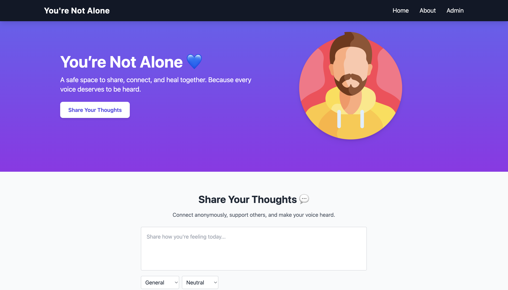
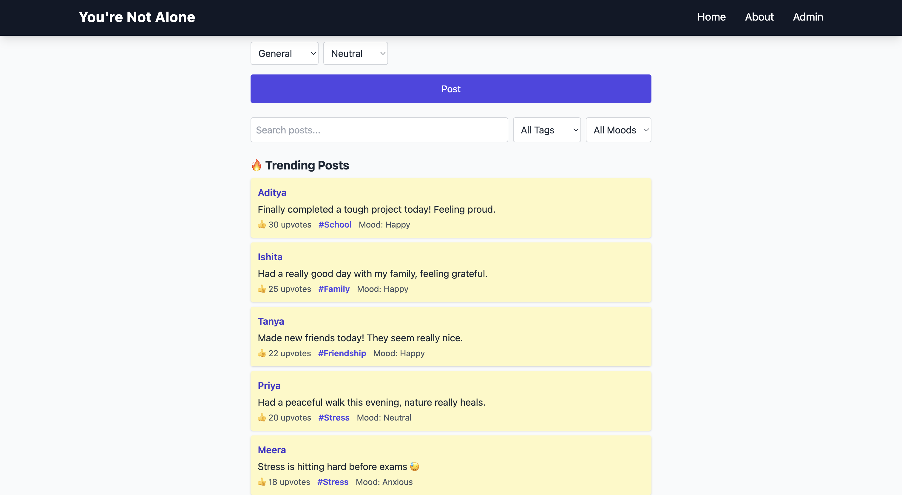
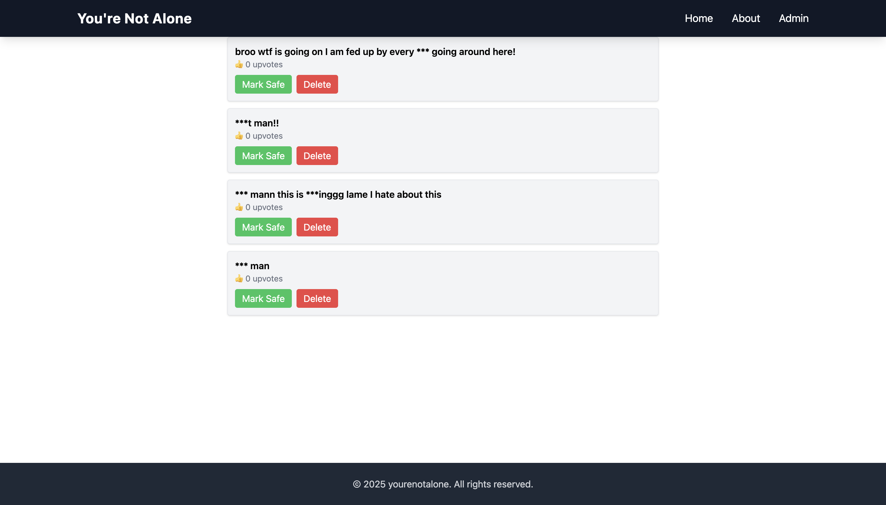

# 🌍 You're Not Alone

> A safe digital space where people can share their thoughts, moods, and struggles anonymously — and know they’re not alone.  
Built for **Hackathons 2025** 🏆  

---

## ✨ Features

- 📝 **Anonymous Posts** — Share your thoughts without revealing your identity.  
- 💭 **Mood & Tags** — Add moods (Happy, Sad, Anxious, etc.) and tags (Stress, School, Friendship, etc.) to your posts.  
- 👍 **Upvotes** — Support others by upvoting posts you connect with.  
- 💬 **Comments** — Engage with others while staying anonymous.  
- 🚩 **Reporting System** — Posts can be flagged and hidden until reviewed.  
- 🛡️ **Admin Panel** — Admin can mark posts as safe or unsafe, and delete harmful content.  
- 🔥 **Trending Section** — See the most upvoted posts in the community.  
- 📱 **Responsive UI** — Works seamlessly on desktop and mobile.  
- ⚡ **Local-First** — Data persists via local storage (easy to switch to a database later).  

---

## 📸 Screenshots (To Be Added After Deploy)

- 🏠 Home Page  
  

- 📈 Trending Posts  
  

- 🚩 Admin Panel  
  

---

## 🚀 Getting Started

### 1️⃣ Clone the Repository
```bash
git clone https://github.com/YOUR_USERNAME/youre-not-alone.git
cd youre-not-alone
```

### 2️⃣ Install Dependencies
```bash
npm install
```

### 3️⃣ Run Locally
```bash
npm run dev
```

## 🌐 Live Demo

👉 You’re Not Alone (https://youre-not-alone.vercel.app)

---

## 🛠️ Tech Stack

- ⚛️ **Frontend:** React + Vite  
- 🎨 **Styling:** TailwindCSS  
- 💾 **State Management:** Local Storage  
- 🌐 **Deployment:** Vercel  

---

## 🧑‍💻 Admin Access

To access the **Admin Panel**:  
🔑 Navigate to: **`/admin`**  
🔐 Enter the **admin password** (default password - "demopasswordfornow").  
> Password can be updated directly in the source code (src/pages/Admin.jsx).
---

## 📌 Roadmap

- ✅ 🔗 Replace `localStorage` with a real database (Firebase / Supabase / MongoDB).  
- ✅ 🔒 Add user authentication.  
- ✅ 💬 Enable real-time comments & live updates.  
- ✅ 🌙 Add Dark Mode toggle for better accessibility.  

---

## 🤝 Contributing

Contributions are always welcome! 🙌  


**1**. Fork the repo 🍴  
**2**. Create a feature branch 🌱  
**3**. Submit a pull request 🚀  


For major changes, please open an issue first to discuss your idea.  

---

## 📜 License

📄 Licensed under the **MIT License** © 2025 [Shloka Jain]  

---


